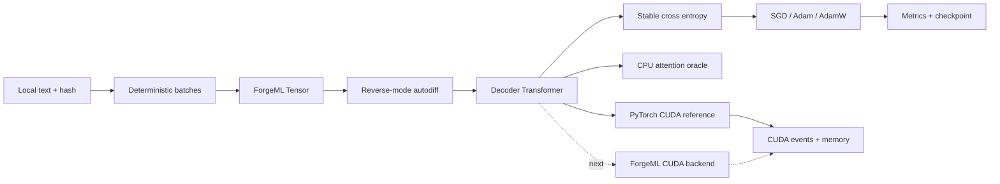
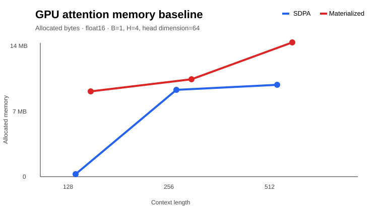
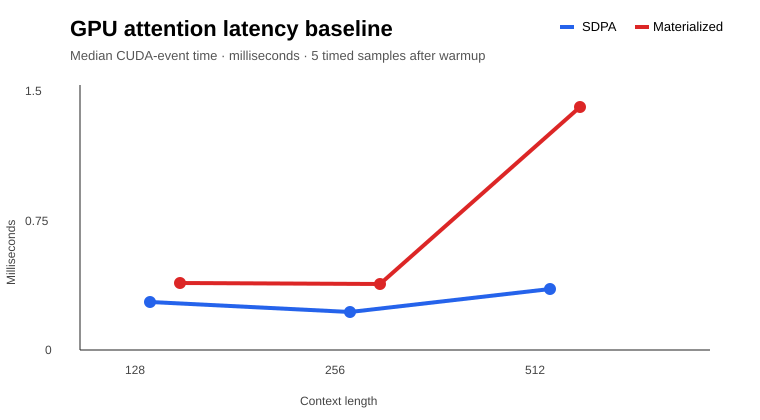

# ForgeML

### A research runtime for compute-efficient Transformer training

[](https://github.com/easyvansh/ForgeML/actions/workflows/tests.yml)
[](https://github.com/easyvansh/ForgeML)
[](cuda/README.md)

ForgeML is a small, inspectable deep-learning runtime built around one question:

> Under a limited compute budget, how should small Transformer language models trade model size, training tokens, context length, and GPU memory movement?

It connects mathematical foundations, ML experimentation, GPU systems engineering, and reproducible research infrastructure in one narrow thesis.

## Current status

**Working CPU runtime + verified PyTorch CUDA baseline + first custom CUDA forward kernel.**

The local environment has PyTorch `2.14.0+cu126`, CUDA runtime `12.6`, and an NVIDIA RTX 3060 Laptop GPU. ForgeML’s own Tensor runtime remains NumPy-based on CPU. The custom CUDA source compiles after loading Visual Studio’s `cl.exe`; execution still requires a compatible driver/toolkit pair because this machine reports toolkit 13.3 while the driver reports compatibility 12.6.

The project does not claim a custom-kernel speedup until the kernel executes, passes parity, and is profiled.

## What has been built

| Layer | Implementation | Evidence |
|---|---|---|
| Tensor runtime | NumPy tensors, broadcasting, reductions, indexing, batched matmul | `forge/tensor.py` |
| Autodiff | Reverse-mode graph traversal, VJPs, accumulation, finite differences | 25-test suite |
| Neural network API | Linear, embedding, LayerNorm, GELU, dropout, causal attention | `forge/nn.py` |
| Language model | Pre-LN decoder-only Transformer with learned positions | Smoke runs |
| Optimization | Momentum SGD, Adam, AdamW | PyTorch update parity |
| Data | Deterministic character dataset, held-out split, SHA-256 metadata | `forge/data.py` |
| GPU reference | PyTorch SDPA/materialized attention with CUDA events and memory counters | `results/torch_attention.json` |
| Custom CUDA | Online-softmax causal forward source and Windows build helper | `cuda/attention_forward.cu` |
| Research record | Proposal, audit, engineering log, paper draft, figures, CI | `docs/`, `paper/`, `.github/` |

## System at a glance



See the [standalone architecture source](docs/figures/architecture.mmd).

## Measured findings

- **25 tests passed, 0 skipped** in the project virtual environment, including PyTorch gradient and optimizer comparisons.
- A 3,832-parameter synthetic Transformer reduced loss from **2.085474 to 0.003107** after 120 updates.
- The character smoke run trained a 9,224-parameter model from **3.475135 to 1.560270**; held-out loss was **1.562343**. This validates data plumbing on a tiny repeated corpus, not general language quality.
- The PyTorch CUDA attention baseline used float16, batch 1, four heads, head dimension 64, CUDA events, warmup, and five timed samples at contexts 128, 256, and 512.





These are PyTorch framework measurements, not custom ForgeML results. The materialized reference used more allocated memory than SDPA at every tested context. Full samples and hardware metadata are in [results/torch_attention.json](results/torch_attention.json).

## The attention idea

The custom kernel streams each score row with online normalization:

```text
m'     = max(m, row_max(scores))
scale  = exp(m - m')
probs  = exp(scores - m')
ell'   = scale * ell + row_sum(probs)
a'     = scale * a + probs @ values_tile
output = a' / ell'
```

This avoids materializing a full `T × T` score matrix. The derivation is in [attention_algorithm.md](docs/figures/attention_algorithm.md).

## Reproduce locally

```powershell
cd D:\Projects\2026\forgeml
python -m venv .venv
.\.venv\Scripts\Activate.ps1
python -m pip install numpy setuptools wheel --trusted-host pypi.org --trusted-host files.pythonhosted.org
python -m pip install -e . --no-build-isolation
python -m unittest discover -s tests -v
```

Run the CPU language-model smoke experiment:

```powershell
python -m forge train configs/char_smoke.json --output runs/char-smoke
```

Run the PyTorch GPU reference:

```powershell
.\.venv\Scripts\python.exe benchmarks/torch_attention.py --seq 128 256 512 1024 --repeats 20 --output results/torch_attention.json
```

Build the custom CUDA forward kernel:

```powershell
.\scripts\build_cuda.ps1
.\build\cuda\attention_forward.exe 128
```

## Research questions

1. Can an independently implemented runtime reproduce trusted numerical behavior?
2. How do SGD, Adam, and AdamW compare under equal initialization, batches, tuning budget, and token budget?
3. When context grows, how much memory and time does IO-aware attention recover?
4. Under fixed FLOPs and separately under fixed wall-clock time, how should parameters and token presentations be allocated?

The project distinguishes unique corpus tokens from repeated presentations, fixed-FLOP budgets from fixed-time budgets, and CPU/PyTorch/custom-CUDA evidence. Planned results are never presented as measured findings.

## Repository guide

```text
forge/                 Tensor, autodiff, layers, optimizers, CLI
cuda/                  Custom CUDA source and build notes
benchmarks/            PyTorch CUDA reference benchmark
configs/               Reproducible experiment configurations
tests/                 Numerical, parity, behavior, integration tests
docs/                  Architecture, audit, protocols, figures, literature
results/               Selected raw evidence and summaries
paper/                 Living technical report and LaTeX manuscript
.github/               CI and issue templates
```

Start with the [implementation audit](docs/AUDIT.md), [research proposal](docs/research-proposal.md), [reproduction guide](docs/reproduction.md), [literature packet](docs/papers.md), and [paper draft](paper/main.md). The [release checklist](RELEASE_CHECKLIST.md) describes what must be verified before tagging a release.

## What remains

- Align the NVIDIA driver/toolkit pair and execute the custom CUDA forward kernel.
- Add CPU/PyTorch/custom-CUDA parity at partial tiles and extreme logits.
- Add custom attention backward and bind CUDA tensors into ForgeML’s training path.
- Add tiled shared-memory scheduling, then profile occupancy, registers, memory traffic, and launch overhead.
- Run licensed-corpus, multi-seed optimizer, context, and model/token allocation studies.
- Fit scaling relationships only after collecting enough independent observations and uncertainty estimates.
- Replace the preliminary report with a final paper based on those results.

## Research integrity

Some explanatory documents were AI-assisted and are identified in the [documentation policy](docs/documentation-policy.md). Code claims are tied to tests or raw artifacts. The repository intentionally excludes virtual environments, secrets, profiler output, and unreviewed large model artifacts through [.gitignore](.gitignore).
